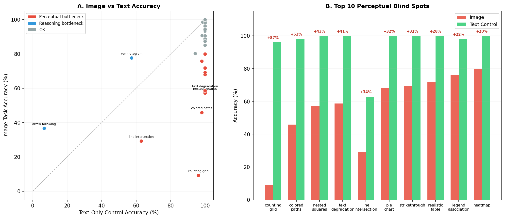
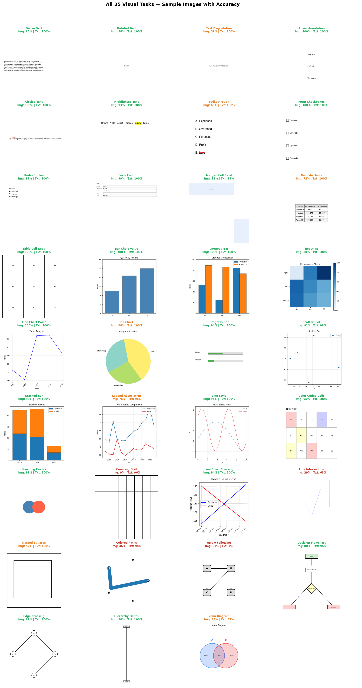
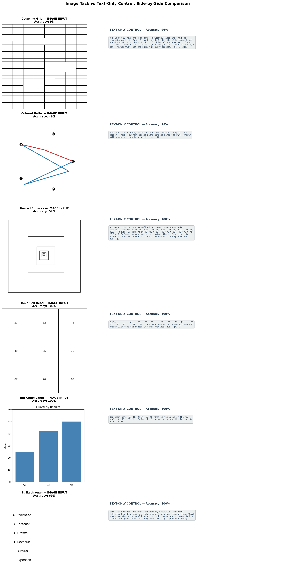
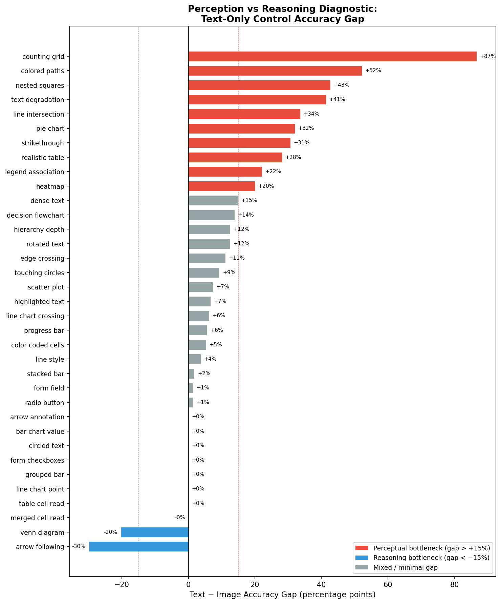
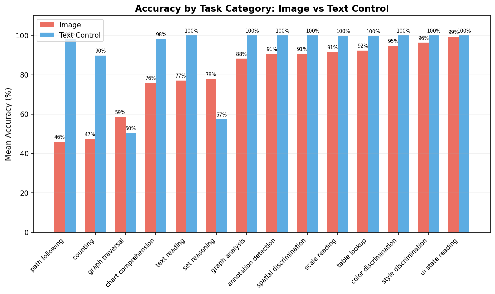
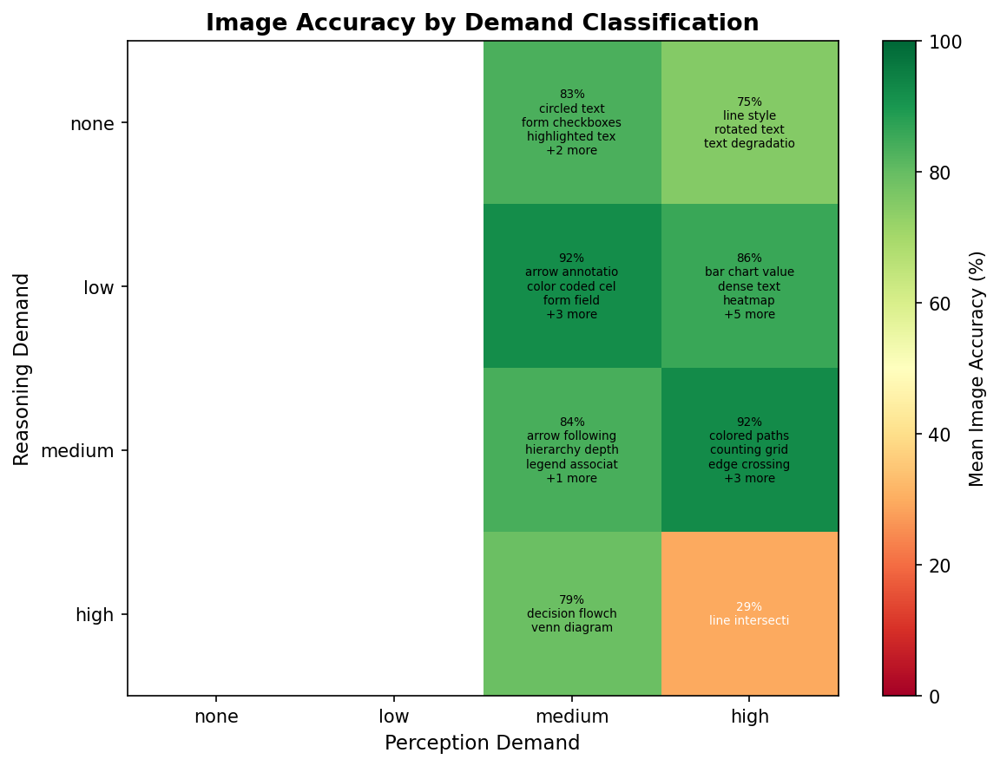
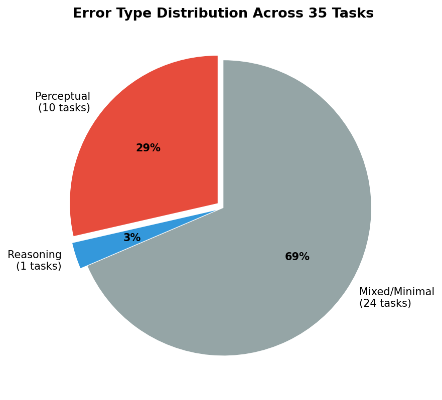
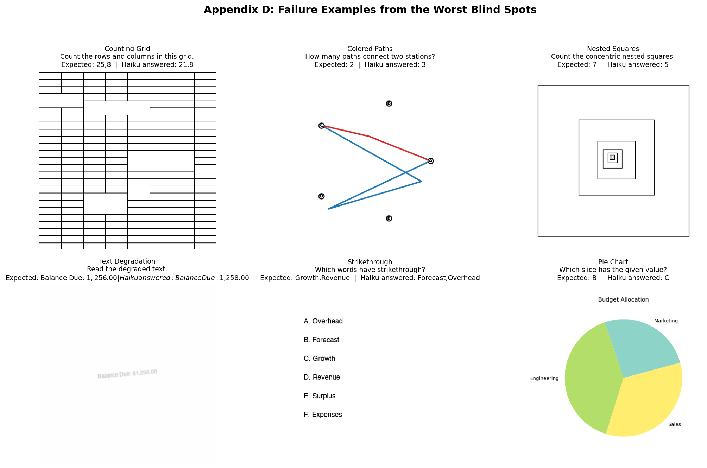

# Diagnosing Vision Failures in Claude Haiku 4.5: Perception or Reasoning?

**Model:** Claude Haiku 4.5 with extended thinking | **Data:** 4,230 evaluations across 35 visual tasks | **February 2026**

---

## TLDR

We tested Claude Haiku 4.5 on 35 synthetic visual tasks, each paired with a text-only control that provides the same data as plain text. This isolates whether failures come from **not seeing** (perception) or **not thinking** (reasoning).

- **82% mean image accuracy vs 95% on text controls.** The 13-point gap is driven by a small number of severe blind spots.
- **10 of 35 tasks have perceptual bottlenecks** — the model solves the problem easily from text but fails from images. These cluster around counting repeated elements (grids, paths, shapes), reading degraded text, and estimating visual proportions.
- **Only 1 task has a reasoning bottleneck** (arrow following) — both modalities fail, meaning better vision won't help.
- **24 tasks (69%) work well** at 95-100% accuracy. Structured content — tables, forms, bar charts, annotations — is reliable.
- **Failures are systematic, not random.** The model overcounts paths at crossing points, undercounts tightly-packed shapes, and confuses visually similar digits. These consistent patterns make them amenable to targeted mitigation.

---

## Methodology

**The core idea:** For each visual task, create a matched text-only control. Both conditions present the same question with the same answer — the only variable is whether the information is delivered as pixels or as text.

- **If accuracy jumps from image to text:** the failure is perceptual. The model understands the task but can't extract information from the image.
- **If accuracy stays low in both:** the failure is a reasoning limitation that better vision won't fix.
- **If accuracy is high in both:** the model handles this task well.

**Task design.** All 35 tasks generate synthetic images with deterministic ground truth, spanning seven categories: text reading, annotation detection, form/UI elements, table lookup, chart reading, chart association/style, and spatial/graph reasoning. Difficulty is controlled via parameter sweeps (grid size, path count, degradation level, etc.).

**Text controls.** Each text control calls the same generation function, discards the image, and constructs a textual description from the metadata. The model receives a placeholder image with a text description and the identical question. This controls for prompt formatting, question phrasing, and answer parsing.

**Evaluation.** Claude Haiku 4.5 (`claude-haiku-4-5-20251001`) with extended thinking, 50-75 samples per task, 4,230 total. Task-specific parsers and scorers (exact match, set match, numeric tolerance).

---

## Key Findings

### The Three Worst Blind Spots

**1. Counting Grid — 9% image vs 96% text (gap: +87%).** Count rows, columns, or cells in a grid. The model miscounts by 2-4 rows consistently (e.g., reporting 21 when there are 25). The problem scales with grid size — small grids occasionally succeed, large ones almost never do. The vision system cannot reliably enumerate repeated identical visual elements like parallel lines.

> *Example:* A 25-row grid. Haiku reports 21 rows — off by 4. The text control describes "12 rows and 4 columns" and the model answers correctly 96% of the time.

**2. Colored Paths — 46% image vs 98% text (gap: +52%).** Count distinctly-colored paths between two stations in a transit diagram. From images, 37 of 40 errors were overcounts (reporting 3-4 paths when there are 2). The model re-counts path segments at crossing points, unable to maintain the identity of individual curves through overlapping regions.

> *Example:* Two paths (red and blue) connect stations C and A. Haiku reports 3 paths, miscounting at the crossing point.

**3. Nested Squares — 57% image vs 100% text (gap: +43%).** Count concentric squares. All 31 errors were undercounts — the model sees outer squares but merges the innermost, tightly-packed ones. Seven squares consistently becomes five. This is a resolution limit: the vision encoder cannot distinguish shapes too close together at small scales.

> *Example:* Seven concentric squares. Haiku reports 5, merging the two innermost.

### The Common Thread

The three worst tasks share one requirement: **precisely counting or tracing repeated visual elements in dense layouts.** The text controls prove the model handles the logic easily. These are failures of visual enumeration — not reasoning.

### Seven More Perceptual Bottlenecks

| Task | Image | Text | Gap | Core failure |
|---|---|---|---|---|
| Text Degradation | 59% | 100% | +41% | Confuses digits 5/6/8 and 2/4 under noise |
| Line Intersection | 29% | 63% | +34% | Mixed: misses shallow-angle intersections |
| Pie Chart | 68% | 100% | +32% | Cannot estimate angular proportions within 10pp |
| Strikethrough | 69% | 100% | +31% | Over-reports: labels all words as struck |
| Realistic Table | 72% | 100% | +28% | Row/column misalignment from visual styling |
| Legend Association | 76% | 98% | +22% | Confuses color/label pairs across series |
| Heatmap | 80% | 100% | +20% | Color-to-value mapping fails for mid-range values |

### One Reasoning Bottleneck

**Arrow Following — 37% image, 7% text (gap: -30%).** Traverse a chain of arrows (A->B->C->D). Even from text, accuracy is 7% — below the 25% random baseline for 4-option questions. The image version actually performs 30 points *higher*, suggesting spatial layout provides navigational cues that abstract text strips away. This is a genuine multi-hop reasoning limitation, not a vision problem.

### What Works Well

Seven tasks achieve **100% from images**: table cell reading, form checkboxes, circled text, arrow annotation, bar chart values, grouped bars, and line chart points. Another nine exceed 95%. The common profile: regular grid-aligned layouts, distinct visual features, and unambiguous mappings. Haiku 4.5 handles structured visual content reliably.

### Implications

The failures are concentrated, not diffuse — which suggests targeted fixes:

- **Counting/enumeration:** delegate to a code interpreter via tool use rather than relying on the vision encoder.
- **Degraded text reading (59%):** higher-resolution encoding or OCR preprocessing.
- **Proportion estimation (pie charts, heatmaps):** training on examples with explicit numeric labels.
- **Arrow-following reasoning:** orthogonal to vision; requires improved multi-step planning.

---

## Appendix A: Full Results Table

| Task | Image Acc | Text Acc | Gap | Classification |
|---|---|---|---|---|
| Counting Grid | 9% | 96% | +87% | Perceptual |
| Colored Paths | 46% | 98% | +52% | Perceptual |
| Nested Squares | 57% | 100% | +43% | Perceptual |
| Text Degradation | 59% | 100% | +41% | Perceptual |
| Line Intersection | 29% | 63% | +34% | Perceptual |
| Pie Chart | 68% | 100% | +32% | Perceptual |
| Strikethrough | 69% | 100% | +31% | Perceptual |
| Realistic Table | 72% | 100% | +28% | Perceptual |
| Legend Association | 76% | 98% | +22% | Perceptual |
| Heatmap | 80% | 100% | +20% | Perceptual |
| Dense Text | 85% | 100% | +15% | Borderline |
| Decision Flowchart | 80% | 94% | +14% | OK |
| Hierarchy Depth | 88% | 100% | +12% | OK |
| Rotated Text | 88% | 100% | +12% | OK |
| Edge Crossing | 89% | 100% | +11% | OK |
| Touching Circles | 91% | 100% | +9% | OK |
| Scatter Plot | 91% | 98% | +7% | OK |
| Highlighted Text | 93% | 100% | +7% | OK |
| Line Chart Crossing | 94% | 100% | +6% | OK |
| Progress Bar | 94% | 100% | +6% | OK |
| Color-Coded Cells | 95% | 100% | +5% | OK |
| Line Style | 96% | 100% | +4% | OK |
| Stacked Bar | 98% | 100% | +2% | OK |
| Form Field | 99% | 100% | +1% | OK |
| Radio Button | 99% | 100% | +1% | OK |
| Merged Cell Read | 99% | 99% | 0% | OK |
| Arrow Annotation | 100% | 100% | 0% | OK |
| Bar Chart Value | 100% | 100% | 0% | OK |
| Circled Text | 100% | 100% | 0% | OK |
| Form Checkboxes | 100% | 100% | 0% | OK |
| Grouped Bar | 100% | 100% | 0% | OK |
| Line Chart Point | 100% | 100% | 0% | OK |
| Table Cell Read | 100% | 100% | 0% | OK |
| Venn Diagram | 78% | 57% | -20% | Text harder |
| Arrow Following | 37% | 7% | -30% | Reasoning |

---

## Appendix B: Task Gallery

All 35 visual tasks with sample images and accuracy labels (image | text).

---

## Appendix C: Image vs Text-Only Control Comparison

Six tasks shown side-by-side: the image the model receives (left) vs the text-only control description (right). The text control provides the same information as plain text, isolating whether failures are perceptual or reasoning-based.

---

## Appendix D: Diagnostic Charts

### D.1: Text-Image Gap, All Tasks

*Tasks ranked by accuracy gap. Red = perceptual bottleneck (gap > 15%), blue = reasoning bottleneck (gap < -15%), gray = minimal gap.*

### D.2: Accuracy by Task Category

*Mean image vs text accuracy by category. Counting and spatial reasoning show the largest gaps.*

### D.3: Image Accuracy by Perception x Reasoning Demand

*Tasks classified by theoretical perception and reasoning demand. Worst region: high perception + medium reasoning (counting, path following).*

### D.4: Error Type Distribution

---

## Appendix E: Failure Examples

*Six representative failures. Each panel shows the input image, the question, the expected answer, and Haiku's response.*

- **Counting Grid** (top left): 25-row grid. Haiku reports 21 rows — off by 4.
- **Colored Paths** (top center): 2 paths between C and A. Haiku reports 3, miscounting at the crossing.
- **Nested Squares** (top right): 7 concentric squares. Haiku reports 5, merging the innermost two.
- **Text Degradation** (bottom left): "$1,256.00" read as "$1,258.00" — digit 5 confused with 8.
- **Strikethrough** (bottom center): Words C and D have strikethrough. Haiku reports B and A — entirely wrong.
- **Pie Chart** (bottom right): Haiku picks option C instead of B, confusing similarly-sized slices.

---

## Appendix F: Detailed Blind Spot Analysis

### Text Degradation — 59% image, 100% text

Read text with noise, blur, or distortion. The model confuses visually similar digits: `$1,256.00` becomes `$1,258.00`, `#C-2024` becomes `#C-2004`. Digits 5/6/8 and 2/4 are the most commonly confused pairs. Alphabetic characters are more robust.

### Line Intersection — 29% image, 63% text

Count intersection points between line segments. A mixed case: text accuracy (63%) is above the 25% random baseline but far from perfect, indicating both perceptual and reasoning contributions. The model misses intersections at shallow angles.

### Pie Chart — 68% image, 100% text

Multiple-choice questions about slice values. The model cannot estimate angular proportions — it confuses slices differing by fewer than 10 percentage points. Questions about the largest slice succeed more often than specific-value questions.

### Strikethrough — 69% image, 100% text

Identify which words have strikethrough formatting. The model over-reports, labeling many or all words as struck when only a subset are. The thin horizontal line is a subtle visual cue detected unreliably.

### Realistic Table — 72% image, 100% text

Extract values from styled tables with borders, shading, and merged headers. The model misaligns rows and columns, reading adjacent cells. Plain tables (Table Cell Read at 100%) work perfectly — visual styling causes misalignment.

### Legend Association — 76% image, 98% text

Match chart series to legend entries. The model occasionally associates the wrong color/label pair, confusing which series is which.

### Heatmap — 80% image, 100% text

Read values from a color-coded grid. The model struggles with color-to-value mapping, especially for mid-range values where color differences are subtle.
