# Diagnosing Vision Failures in Claude Haiku 4.5: Perception or Reasoning?

**Model:** Claude Haiku 4.5 with extended thinking | **Data:** 4,101 evaluations across 34 visual tasks | **February 2026**

---

## TLDR

We tested Claude Haiku 4.5 on 34 synthetic visual tasks, each paired with a text-only control that provides the same data as plain text. This isolates whether failures come from **not seeing** (perception) or **not thinking** (reasoning).

- **81% mean image accuracy vs 95% on text controls.** The 14-point gap is driven by a small number of severe blind spots.
- **8 of 34 tasks have perceptual bottlenecks** — the model solves the problem easily from text but fails from images. These cluster around counting repeated elements (grids, paths, shapes), reading degraded text, and estimating visual proportions.
- **2 tasks have mixed bottlenecks** (arrow following, venn diagram) — both modalities fail, meaning better vision alone won't help. Arrow following requires multi-hop graph traversal; venn diagrams require spatial reading combined with set reasoning.
- **24 tasks (71%) work well** at 85-100% accuracy. Structured content — tables, forms, bar charts, annotations — is reliable.
- **Failures are systematic, not random.** Three cross-cutting patterns explain all worst tasks: enumeration failure (losing count of repeated elements), fine-grained discrimination failure (confusing visually similar features), and multi-hop reasoning failure (unable to traverse graphs or compute set operations). These consistent patterns make them amenable to targeted mitigation.

---

## Methodology

**The core idea:** For each visual task, create a matched text-only control. Both conditions present the same question with the same answer — the only variable is whether the information is delivered as pixels or as text.

- **If accuracy jumps from image to text:** the failure is perceptual. The model understands the task but can't extract information from the image.
- **If accuracy stays low in both:** the failure is a reasoning limitation that better vision won't fix.
- **If accuracy is high in both:** the model handles this task well.

**Task design.** All 34 tasks generate synthetic images with deterministic ground truth, spanning seven categories. Difficulty is controlled via parameter sweeps:

| Category | Task | Key Sweep Parameters |
|---|---|---|
| **Text reading** | dense_text | font_size [8–14], n_lines [5–10], line_spacing [1.0–1.5] |
| | rotated_text | rotation [0°–90°], font_size [10–24] |
| | text_degradation | font_size [8–28], blur_radius [0–3], rotation [0°–5°], contrast [0.3–1.0] |
| **Annotation detection** | arrow_annotation | n_words [3–6], arrow_width [1–4] |
| | circled_text | font_size [14–36], ellipse_thickness [1–4] |
| | highlighted_text | n_words [5–8], n_highlighted [1–3], font_size [14–24] |
| | strikethrough | n_words [5–8], n_struck [1–3], line_thickness [1–3], font_size [12–24] |
| **Form/UI elements** | form_checkboxes | n_options [4–8], n_checked [1–4], box_size [12–20] |
| | form_field | n_fields [5–12], font_size [10–16], field_style [boxed, underlined] |
| | radio_button | n_groups [1–3], options_per_group [3–4], circle_size [8–20] |
| **Table lookup** | table_cell_read | rows [3–8], cols [3–8], font_size [10–20] |
| | realistic_table | n_rows [4–12], n_cols [3–6], font_size [9–18] |
| | merged_cell_read | rows [4–8], cols [4–6], n_merged [1–3], font_size [10–14] |
| | color_coded_cells | rows [3–5], cols [3–5], n_colored [2–4], target_color [red, green, yellow] |
| **Chart reading** | bar_chart_value | n_bars [3–7], value_range_hi [50–90] |
| | grouped_bar | n_groups [3–5], n_series [2–3] |
| | stacked_bar | n_bars [3–6], n_segments [2–3] |
| | line_chart_point | n_points [5–15], marker_size [3–8], gridlines [on/off] |
| | pie_chart | n_slices [3–7] |
| | scatter_plot | n_points [5–12], marker_size [3–8], n_series [1–2] |
| | heatmap | grid_size [3–6], colormap [Blues, YlOrRd, viridis] |
| | progress_bar | n_bars [2–4], bar_height [15–30] |
| **Chart association** | legend_association | n_series [2–4], color_mode [distinct, similar] |
| | line_chart_crossing | resolution [384–1024], target_crossings [0–3] |
| | line_style | n_lines [2–4], line_width [1–3] |
| **Spatial/graph** | arrow_following | n_boxes [4–10], n_arrows [4–14] |
| | colored_paths | n_paths [1–4], thickness [3–20], resolution [384–768] |
| | counting_grid | rows [4–25], cols [4–25], n_merged [0–6], question_type [grid_size, total_cells, merged_count] |
| | decision_flowchart | template [linear, two_decision, diamond_chain, loop_with_exit], resolution [512–768] |
| | edge_crossing | n_nodes [4–6], n_edges [4–8], bridge_gap [3–10] |
| | hierarchy_depth | depth [2–5], branching [2–3] |
| | nested_squares | depth [2–8], reduction_factor [0.4–0.8], line_thickness [1–3] |
| | touching_circles | distance [-0.25–0.25], diameter [0.08–0.2], resolution [384–1152] |
| | venn_diagram | n_circles [2–4], question_type [intersection, exclusive, union_minus] |

**Text controls.** Each text control calls the same generation function, discards the image, and constructs a textual description from the metadata. The model receives a placeholder image with a text description and the identical question. This controls for prompt formatting, question phrasing, and answer parsing.

**Evaluation.** Claude Haiku 4.5 (`claude-haiku-4-5-20251001`) with extended thinking, 50-75 samples per task, 4,101 total. All tasks scored with exact match or set match — no partial credit or numeric tolerance.

---

## Key Findings

### The Top 10 Worst-Performing Tasks

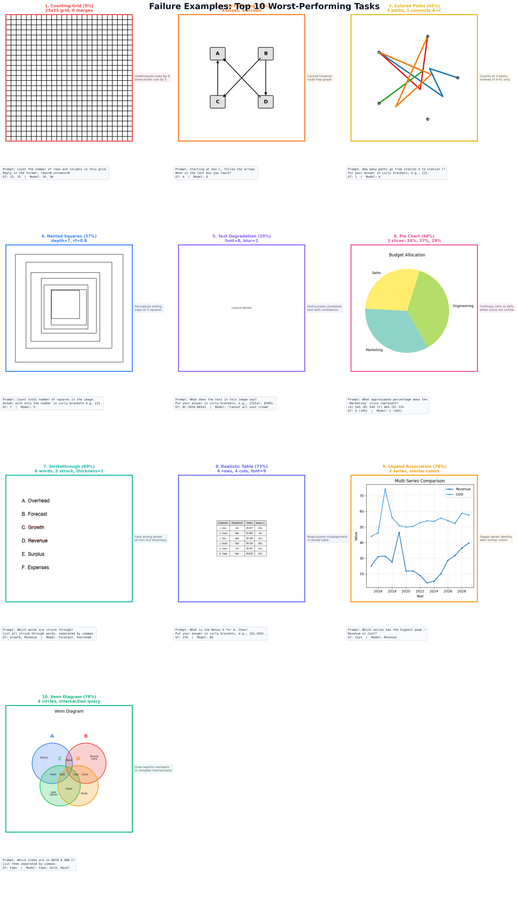
*One representative failure per task. Each panel shows the input image, the prompt sent to the model, the expected answer (GT), and Haiku's response.*

---

**1. Counting Grid — 9% image, 96% text (gap: +87%).** Count rows, columns, or cells in a grid. Of 68 failures, the model miscounts by 2-4 rows consistently. The problem scales sharply with grid size: accuracy is 18% at 4 rows but 0% at 18 rows. Merged-cell counting (question_type=merged_count) is slightly better (19%) than total-cell counting (3%), but all variants are unreliable. The vision encoder cannot reliably enumerate repeated identical visual elements like parallel lines.

> *Prompt:* "Count the number of rows and columns in this grid. Reply in the format: rows=N columns=M"
> *Error pattern:* Undercounts rows, overcounts columns. A 25×25 grid is read as 16×30.

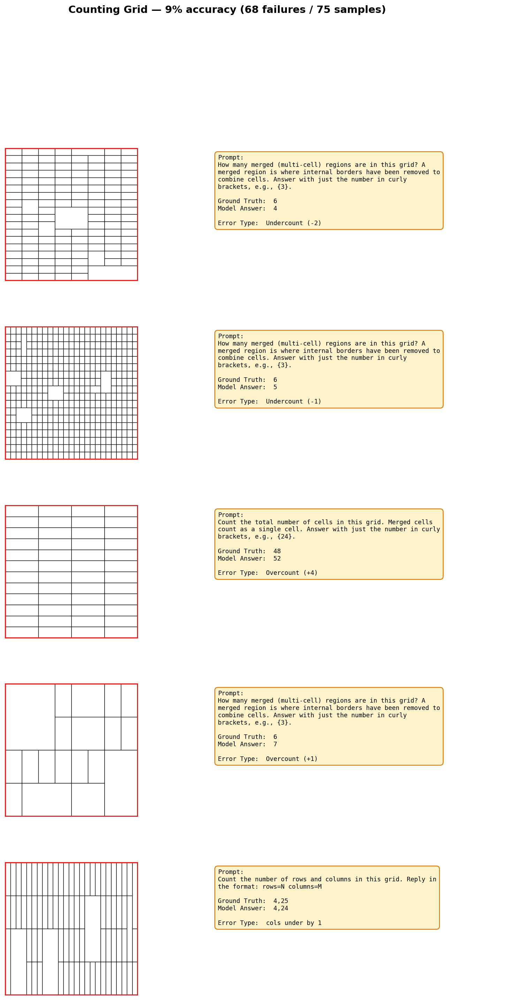
*5 representative failures showing undercount, overcount, and dimension-swap errors across varying grid sizes and merge configurations.*

**2. Arrow Following — 15% image, 3% text (gap: -12%, reasoning bottleneck).** Follow a chain of directed arrows between labeled boxes and identify all possible terminal boxes. Both modalities fail badly — with set match scoring (all terminals must be named), even text accuracy is only 3%. The model cannot reliably traverse multi-hop directed graphs in either modality. From images, the model struggles to read arrow directions and instead follows label alphabetical order; from text, it fails to enumerate all reachable terminal nodes.

> *Prompt:* "Starting at box C, follow the arrows. Which boxes can you end at? List all possible final boxes."
> *Error pattern:* Reports only one terminal instead of all reachable ones, or follows label order rather than arrow direction.

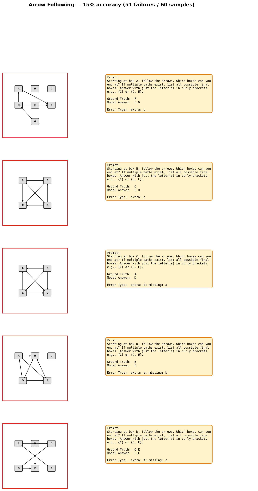
*5 representative failures showing graph traversal errors — the model follows label alphabetical order instead of arrow direction.*

**3. Colored Paths — 46% image, 98% text (gap: +52%).** Count distinctly-colored paths connecting two specific stations in a transit diagram. Of 40 errors, 37 were overcounts (93%). The model re-counts path segments at crossing points, unable to maintain the identity of individual curves through overlapping regions. Accuracy degrades with more paths (83% at 1 path → 28% at 4 paths) and improves with thicker lines (32% at thickness=6 → 59% at thickness=20).

> *Prompt:* "How many paths go from station A to station C? Put your answer in curly brackets, e.g., {2}."
> *Error pattern:* Overcounts. Reports 4 paths when only 1 connects the requested stations — counts all paths in the diagram instead of filtering by endpoint.

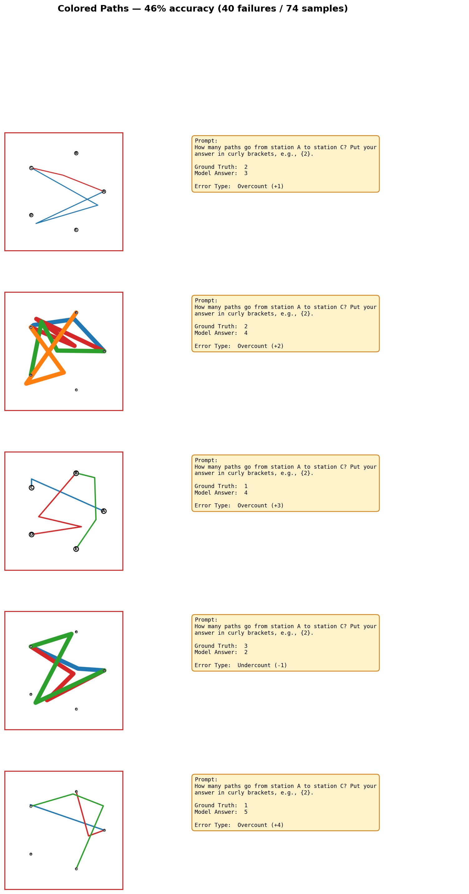
*5 representative failures — overcounting dominates, with the model counting all visible paths instead of filtering by endpoint.*

**4. Nested Squares — 57% image, 100% text (gap: +43%).** Count concentric squares. All 31 errors were undercounts. There is a clear perceptual ceiling at depth ≈5: depths 2-4 score 100%, depth 5 drops to 50%, and depths 6-8 collapse to 0-14%. The model sees outer squares but merges the innermost, tightly-packed ones. Seven squares consistently becomes five. Smaller reduction factors (more tightly nested) make this worse: 44% at rf=0.4 vs 69% at rf=0.7.

> *Prompt:* "Count total number of squares in the image. Answer with only the number in curly brackets e.g. {3}."
> *Error pattern:* Undercounts by 1-2. Seven squares → five. The model caps at ~5 distinguishable layers.

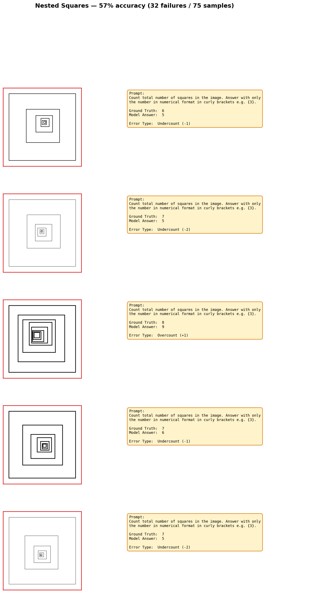
*5 representative failures — systematic undercounting with a perceptual ceiling at ~5 nested levels.*

**5. Text Degradation — 59% image, 100% text (gap: +41%).** Read text rendered with noise, blur, rotation, or reduced contrast. The primary failure mode is digit confusion: visually similar pairs 5↔6, 6↔8, 2↔4, and 0↔2 account for most errors. Accuracy degrades sharply with blur (86% at blur=0, 13% at blur=3) and small font (24% at font=8, 81% at font=28). At extreme degradation, the model hallucinates entirely unrelated text with full confidence.

> *Prompt:* "What does the text in this image say? Put your answer in curly brackets, e.g., {Total: $500}."
> *Error pattern:* Digit confusion ($1,256.00 → $1,258.00) at moderate degradation. Full hallucination ("Contract #C-2024-00341" → "Cannot all sour cream") at high degradation.

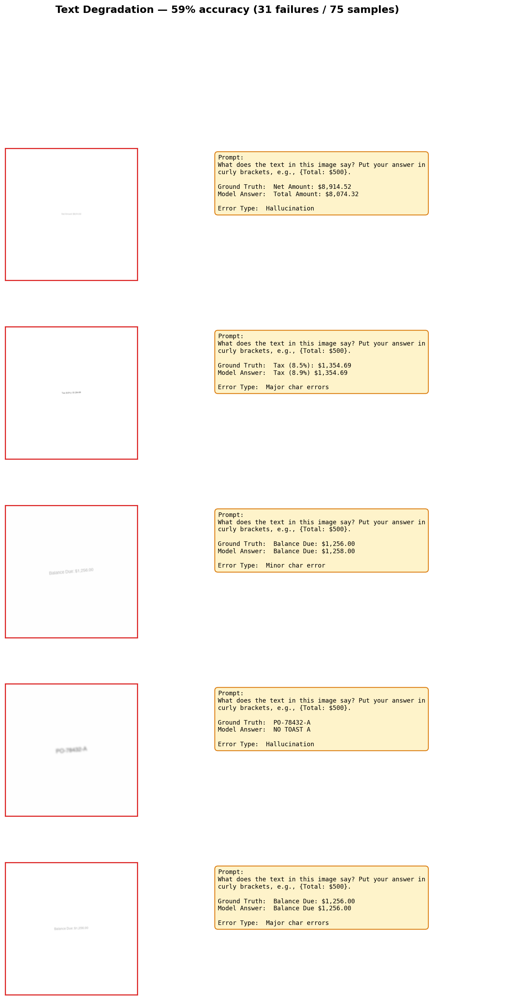
*5 representative failures spanning hallucination, digit confusion, and major character errors under varying blur and font size.*

**6. Venn Diagram — 63% image, 57% text (gap: -6%, mixed bottleneck).** Identify which items belong to specific set intersections or exclusions. Both image and text accuracy are low, indicating a combined perceptual + reasoning bottleneck. Accuracy drops sharply with more circles: 83-89% for 2-3 circles, 50-61% for 4 circles. The hardest question type is union_minus ("items in B but NOT in A") at 61% vs 89% for exclusive queries. The model over-reports items, including members from adjacent regions. This is a combined spatial reading + set reasoning challenge.

> *Prompt:* "Which items are in BOTH A AND C? List them separated by commas."
> *Error pattern:* Reports "Fawn, Gold, Hazel" when only "Fawn" is in the intersection — includes items from neighboring regions.

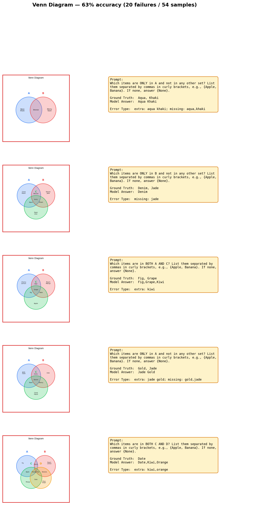
*5 representative failures — the model includes items from adjacent regions when computing set intersections.*

**7. Pie Chart — 66% image, 100% text (gap: +34%).** Estimate the percentage a labeled slice represents, answered as multiple choice. With well-separated slices (≥8pp gap between all pairs), the model still confuses slices that appear visually similar. Accuracy varies with slice count but not monotonically, suggesting the difficulty depends more on how similar the visual proportions are than on the number of slices.

> *Prompt:* "What approximate percentage does the 'Marketing' slice represent? (A) 34% (B) 54% (C) 46% (D) 22%"
> *Error pattern:* Selects a nearby distractor. The model cannot estimate angular proportions precisely.

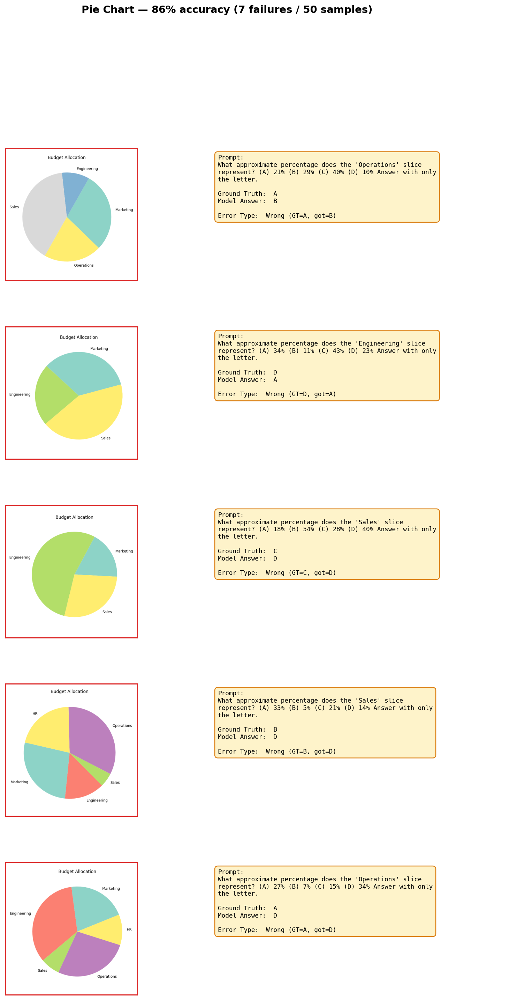
*5 representative failures — the model selects nearby distractors when slice proportions are visually similar.*

**8. Strikethrough — 69% image, 100% text (gap: +31%).** Identify which words have a horizontal line drawn through them. The dominant factor is line thickness: accuracy is 25% at thickness=1 but 96% at thickness=2 or 3. With thin lines, the model identifies the wrong words entirely — not just missing some, but hallucinating strikethrough on unstruck words. Larger font sizes paradoxically hurt (88% at font=12, 53% at font=24), possibly because the thin line becomes proportionally less visible relative to the letter height.

> *Prompt:* "Which words are struck through? List all struck-through words, separated by commas."
> *Error pattern:* Reports "Forecast, Overhead" when the struck words are "Growth, Revenue" — wrong words entirely at thin line widths.

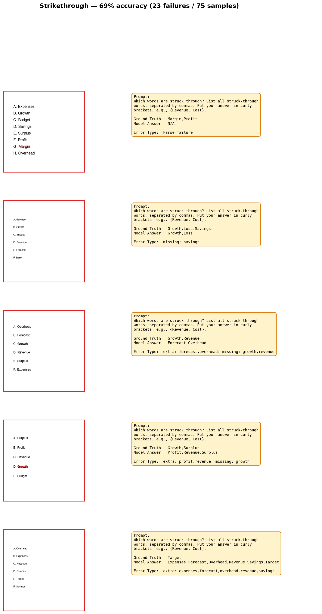
*5 representative failures — the model hallucinates strikethrough on wrong words, especially at thin line widths.*

**9. Legend Association — 76% image, 98% text (gap: +22%).** Match a chart series to its legend entry and determine which has the highest peak. The color_mode parameter is decisive: 96% accuracy with distinct colors (red vs blue) but only 56% with similar colors (two shades of blue-green). 9 of 13 errors were the model swapping "Cost" for "Revenue" — it sees the peaks correctly but associates them with the wrong legend label. This is a color-to-label binding failure, not a value-reading failure.

> *Prompt:* "Which series has the highest peak — Revenue or Cost?"
> *Error pattern:* Reports "Revenue" when "Cost" has the highest peak — swaps series identity when colors are similar.

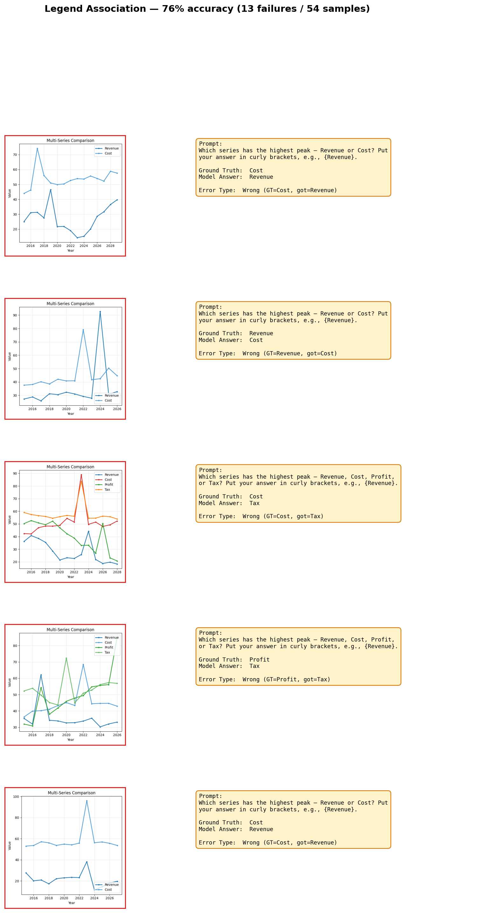
*5 representative failures — the model swaps series identity when legend colors are similar.*

**10. Heatmap — 80% image, 100% text (gap: +20%).** Read values from a color-coded grid. The model struggles with color-to-value mapping, especially for mid-range values where color differences are subtle. Extreme values (dark/light) are read correctly; intermediate shades are confused with neighbors on the colormap.

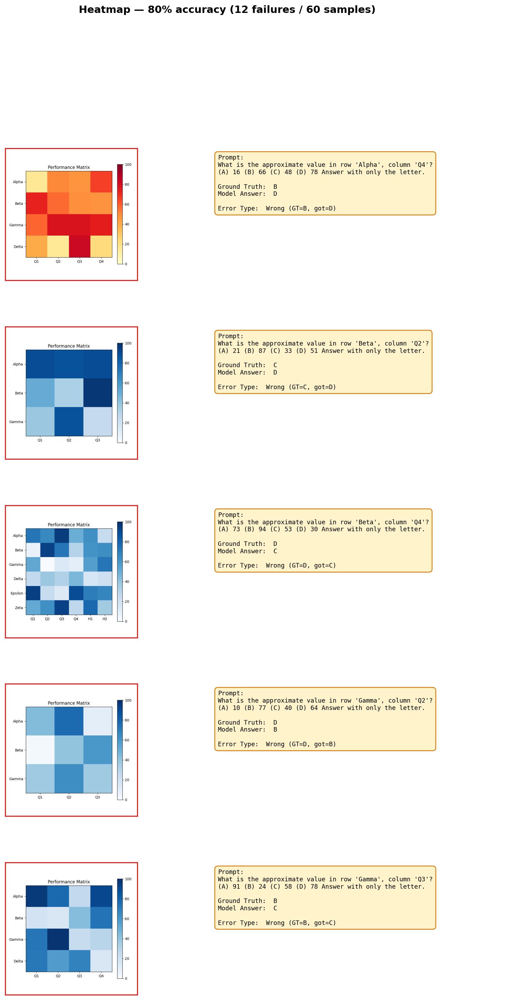
*5 representative failures — the model confuses mid-range colors on the colormap.*

---

### Cross-Cutting Error Patterns

Three systematic patterns emerge across the worst-performing tasks:

**1. Enumeration failure (tasks 1, 3, 4).** The model cannot precisely count or trace repeated visual elements in dense layouts. Grid lines, overlapping paths, and concentric shapes all trigger the same failure: the vision encoder loses track of individual elements when they are visually similar and spatially close. Errors are directional — overcounting at crossing points (colored paths), undercounting tightly packed elements (nested squares, grid rows).

*Mitigations:* Delegate counting to a code interpreter via tool use — have the model describe the visual structure (e.g., "I see horizontal lines at these approximate positions"), then count programmatically. Alternatively, tile or crop the image into smaller regions where the element count is within the reliable range (≤5), then sum. For grids specifically, edge-detection preprocessing could convert the image to a countable representation before the model sees it.

**2. Fine-grained discrimination failure (tasks 5, 7, 8, 9, 10).** The model cannot distinguish between visually similar features: similar digits (5↔6↔8), similar angular proportions (34% vs 46% of a circle), thin annotations (1px strikethrough lines), similar legend colors, or mid-range heatmap values. These all require pixel-level precision that the vision encoder does not provide.

*Mitigations:* These are addressable at the application layer without model changes. For degraded text, run OCR preprocessing (e.g., Tesseract) and provide the OCR output alongside the image. For pie charts and heatmaps, add explicit numeric labels to the visualization — this converts a hard estimation problem into a reliable text-reading task (which the model handles at near-100%). For strikethrough detection, enforce minimum line thickness ≥2px in the rendering pipeline. For legend association, use maximally distinct colors (avoid similar hues) or add pattern fills (dashed, dotted) as a redundant encoding channel.

**3. Multi-hop reasoning failure (tasks 2, 6).** Arrow following and venn diagram both require chaining multiple logical steps — traversing a directed graph or computing set intersections. Both tasks fail from text as well as images, confirming the bottleneck is in reasoning rather than perception. The image modality provides minimal advantage for arrow following (15% vs 3%) since spatial cues help somewhat, while venn diagrams show similar accuracy in both modalities (63% vs 57%).

*Mitigations:* Since these failures are orthogonal to vision, they require reasoning-layer interventions. For graph traversal, tool-assisted approaches work: have the model extract the graph structure (nodes and edges) from the image, then call a graph algorithm tool to compute reachability or terminal nodes. For set operations on venn diagrams, a similar decomposition helps — first extract which items are in which regions, then compute the set operation programmatically. Chain-of-thought prompting with explicit intermediate state tracking ("Current node: C. Outgoing edges: C→A, C→D. Following C→A...") may also improve accuracy by externalizing the working memory that the model struggles to maintain internally.

### What Works Well

Seven tasks achieve **100% image accuracy** (450 evaluations, zero errors): table cell reading, realistic table, form checkboxes, circled text, arrow annotation, bar chart values, grouped bars, and line chart points. Another four exceed 95%: merged cell read (99%), radio button (99%), form field (99%), and stacked bar (98%).

These 15 tasks share a common profile:

- **Grid-aligned layouts.** Tables, forms, and bar charts use regular rectangular geometry with clear spatial separation between elements. The model reliably maps row/column coordinates to cell values (table cell read: 75/75 correct).
- **Distinct visual features.** Checkboxes have unambiguous binary states (checked vs. unchecked). Circled and arrow-annotated words use high-contrast overlays (red circles, red arrows) that stand out from surrounding text. Bar chart values are read from axis-aligned rectangular heights with labeled axes and gridlines.
- **Unambiguous mappings.** Each visual element maps to exactly one answer. "What word does the red arrow point to?" has no room for interpretation — the arrow either points at a word or it doesn't. Contrast this with pie chart proportions, where the model must estimate continuous angular values.
- **Multiple-choice format helps.** Chart reading tasks (bar, grouped bar, line chart point) use 4-option multiple choice with well-separated values, converting a hard estimation problem into an easier discrimination problem.

The practical implication: **structured document content — tables, forms, labeled charts, annotated text — is a strength.** Applications processing these content types can rely on Haiku 4.5's vision with high confidence.

### Implications

A common thread across all three patterns: the most effective mitigations are **architectural** (tool use, preprocessing, decomposition) rather than prompting-based. The model's vision and reasoning limitations are consistent enough to be routed around systematically. Applications that encounter these failure modes should invest in pipeline design — adding OCR, code interpreters, or graph tools — rather than relying on prompt engineering to push accuracy higher within the model's native capabilities.

---

## Appendix A: Full Results Table

| Task | Image Acc | Text Acc | Gap | Classification |
|---|---|---|---|---|
| Counting Grid | 9% | 96% | +87% | Perceptual |
| Colored Paths | 46% | 98% | +52% | Perceptual |
| Nested Squares | 57% | 100% | +43% | Perceptual |
| Text Degradation | 59% | 100% | +41% | Perceptual |
| Pie Chart | 66% | 100% | +34% | Perceptual |
| Strikethrough | 69% | 100% | +31% | Perceptual |
| Legend Association | 76% | 98% | +22% | Perceptual |
| Heatmap | 80% | 100% | +20% | Perceptual |
| Dense Text | 85% | 100% | +15% | Borderline |
| Decision Flowchart | 80% | 94% | +14% | OK |
| Hierarchy Depth | 88% | 100% | +12% | OK |
| Edge Crossing | 89% | 100% | +11% | OK |
| Touching Circles | 91% | 100% | +9% | OK |
| Scatter Plot | 91% | 98% | +7% | OK |
| Line Chart Crossing | 94% | 100% | +6% | OK |
| Progress Bar | 94% | 100% | +6% | OK |
| Color-Coded Cells | 95% | 100% | +5% | OK |
| Line Style | 96% | 100% | +4% | OK |
| Stacked Bar | 98% | 100% | +2% | OK |
| Form Field | 99% | 100% | +1% | OK |
| Radio Button | 99% | 100% | +1% | OK |
| Merged Cell Read | 99% | 99% | 0% | OK |
| Arrow Annotation | 100% | 100% | 0% | OK |
| Bar Chart Value | 100% | 100% | 0% | OK |
| Circled Text | 100% | 100% | 0% | OK |
| Form Checkboxes | 100% | 100% | 0% | OK |
| Grouped Bar | 100% | 100% | 0% | OK |
| Line Chart Point | 100% | 100% | 0% | OK |
| Table Cell Read | 100% | 100% | 0% | OK |
| Realistic Table | 100% | 98% | -2% | OK |
| Venn Diagram | 63% | 57% | -6% | Mixed |
| Arrow Following | 15% | 3% | -12% | Mixed |

---

## Appendix B: Task Gallery

All 34 visual tasks with sample images and accuracy labels (image | text).

---

## Appendix C: Image vs Text-Only Control Comparison

Six tasks shown side-by-side: the image the model receives (left) vs the text-only control description (right). The text control provides the same information as plain text, isolating whether failures are perceptual or reasoning-based.

---

## Appendix D: Diagnostic Charts

### D.1: Text-Image Gap, All Tasks

*Tasks ranked by accuracy gap. Red = perceptual bottleneck (gap > 15%), blue = reasoning bottleneck (gap < -15%), gray = minimal gap.*

### D.2: Accuracy by Task Category

*Mean image vs text accuracy by category. Counting and spatial reasoning show the largest gaps.*

### D.3: Image Accuracy by Perception x Reasoning Demand

*Tasks classified by theoretical perception and reasoning demand. Worst region: high perception + medium reasoning (counting, path following).*

### D.4: Error Type Distribution

---

## Appendix E: Additional Notes

### Dense Text — 85% image, 100% text (gap: +15%, borderline)

Read a specific line from a dense multi-line document. Accuracy drops with smaller font sizes and tighter line spacing. At font=8 with spacing=1.0, the model occasionally reads the wrong line or drops characters. This is a borderline case — usable in most settings but unreliable at the smallest sizes.
