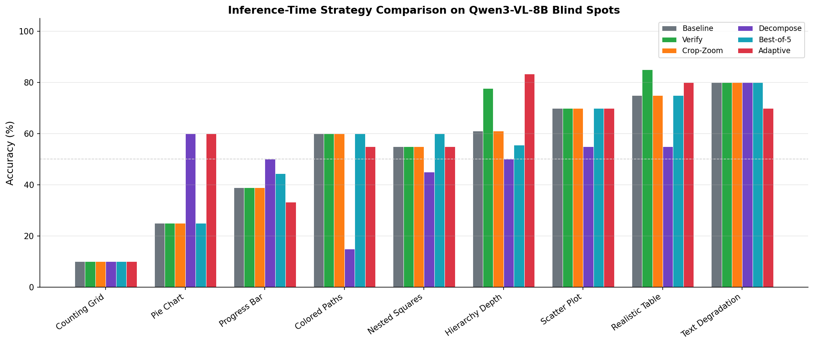
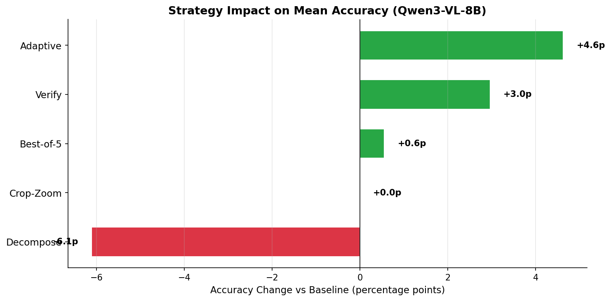
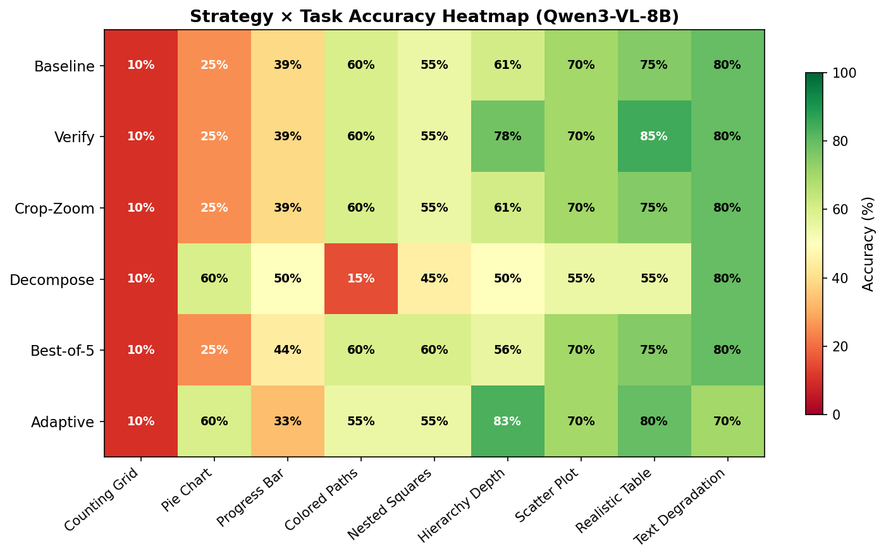
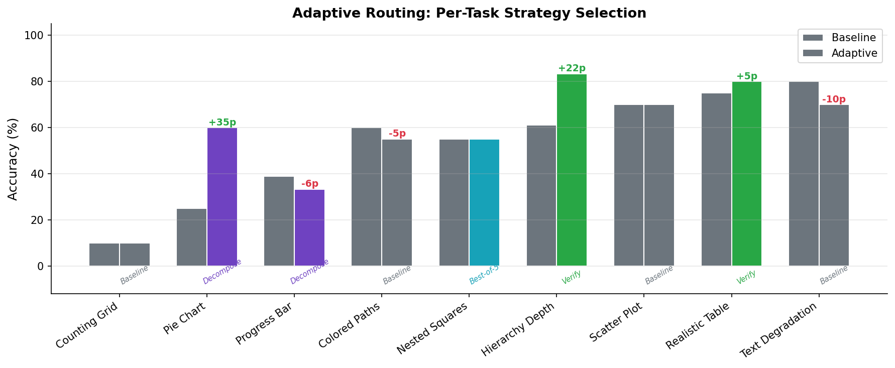
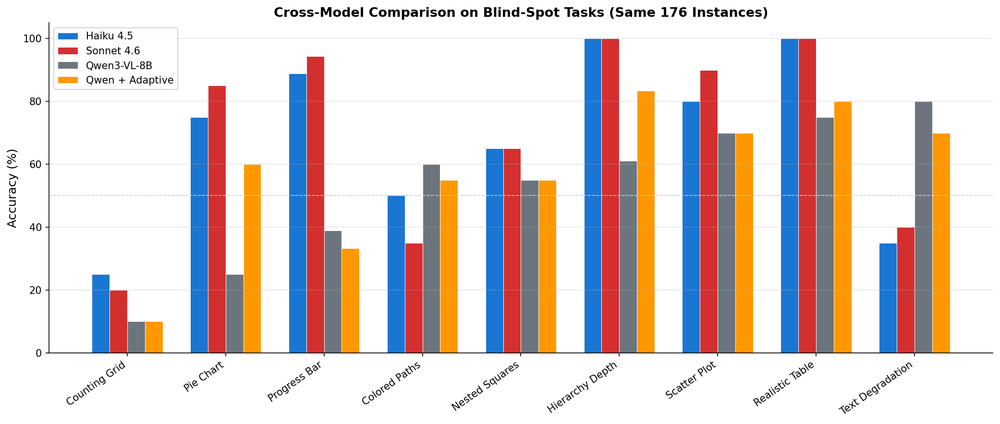
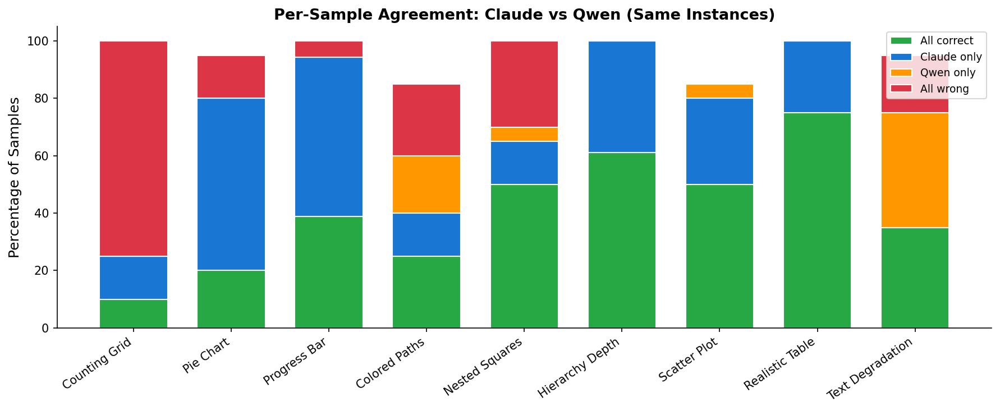

# Inference-Time Strategies for Closing VLM Perception Gaps

## Abstract

We evaluate seven inference-time strategies for improving vision-language model (VLM) accuracy on perceptual blind-spot tasks without model retraining. Using the VLM Blind Spots diagnostic framework, we benchmark **Qwen3-VL-8B** on 176 synthetic image samples across 9 tasks where the model exhibits the largest perception gaps. Our best approach — **adaptive per-task routing** — improves mean accuracy from 52.8% to 57.4% (+4.6 percentage points) by selecting the optimal strategy for each task type. We also present an apples-to-apples cross-model comparison with Claude Haiku 4.5 and Claude Sonnet 4.6 on the same instances, finding that inference-time strategies close approximately 27% of the gap between Qwen3-VL-8B and the Claude models.

## 1. Introduction

Vision-language models often fail on visual tasks that should be straightforward — reading pie chart proportions, counting nested shapes, or following colored paths through a graph. Our prior analysis of Qwen3-VL-8B revealed a **15.3 percentage-point perception gap** between image-based and text-only performance (70.3% vs 85.6%), with 9 tasks showing particularly severe blind spots.

A natural question is whether these failures can be mitigated at inference time, using additional model calls rather than expensive retraining. Inspired by recent work on inference-time compute scaling, we implement and evaluate seven strategies that compose with our existing evaluation harness:

1. **Verify** — two-pass answer-then-verify with task-specific prompts
2. **Best-of-N** — majority voting over N=5 samples at temperature 0.7
3. **Crop-Zoom** — image tiling and region-specific re-querying
4. **Decompose** — structured sub-question decomposition with context accumulation
5. **Code Vision** — model writes Python analysis code executed in a sandbox
6. **Iterative Refine** — multi-round critique with task-specific prompts and convergence detection
7. **Adaptive** — per-task routing to the empirically best strategy

## 2. Methodology

### 2.1 Evaluation Framework

Each sample consists of a synthetically generated image, a question with a known ground truth, and a matched text-only control. The perception gap — the accuracy difference between image and text modalities — isolates perceptual failures from reasoning limitations.

All evaluations use the same 176-sample benchmark manifest across 9 blind-spot tasks, ensuring apples-to-apples comparison across strategies and models.

### 2.2 Strategy Descriptions

#### Baseline (1 API call)
Single-pass query: send the image and prompt to the model, parse the response.

#### Verify (2 API calls)
Two-pass approach:
1. **Initial answer**: Query the model normally
2. **Verification**: Re-present the image with the initial answer and a task-specific verification prompt asking the model to re-examine its response

Task-specific prompts address known failure modes. For example, the hierarchy_depth verify prompt explicitly instructs: *"Count the number of HORIZONTAL ROWS of boxes, NOT the number of connections/edges between rows"* — targeting the systematic +1 overcount bias observed in Qwen3-VL-8B.

#### Best-of-N (N API calls)
Sample N=5 responses at temperature 0.7 and return the majority-voted answer. This reduces random noise but cannot correct systematic biases.

#### Crop-Zoom (2-5 API calls)
Task-specific image manipulation:
1. Tile or crop the image into regions relevant to the task
2. Re-query the model on each region
3. Aggregate responses (e.g., take the crop-specific answer for table cells, count across tiles for counting tasks)

Crop configurations are task-specific: pie charts use quadrant crops focusing on slice boundaries; counting grids use a 2x2 tile grid; tables crop to specific rows.

#### Decompose (2-3 API calls)
Break the task into sequential sub-questions with context accumulation:
1. **Step 1**: Ask a simpler prerequisite question (e.g., "How many slices are in this pie chart?")
2. **Step 2**: Use Step 1's answer as context for the main question
3. **Final**: Synthesize sub-answers into the final response

Decomposition plans are task-specific. For pie charts: first identify all slices and their labels, then estimate the target slice's proportion relative to the whole.

#### Iterative Refine (2-5 API calls)
Multi-round prompt refinement with convergence detection:
1. **Round 1**: Query the model normally
2. **Rounds 2-N**: Present all prior answers with a task-specific critique prompt asking the model to re-examine
3. **Convergence**: Stop early when the parsed answer is identical for 2 consecutive rounds (default max_rounds=5)

Task-specific critiques target known failure modes. For hierarchy_depth: "Count HORIZONTAL ROWS of boxes, not connections." For pie_chart: "Verify percentages sum to 100%, use 25%/50% anchors." A generic fallback is used for tasks without specific critiques.

#### Adaptive (varies)
Route each task to its empirically best strategy based on benchmark data. The routing table is tuned per-model — strategies that help one model may hurt another.

### 2.3 Models

| Model | Parameters | API | Notes |
|-------|-----------|-----|-------|
| Qwen3-VL-8B | 8B | LM Studio (local) | Primary evaluation target |
| Claude Haiku 4.5 | — | Anthropic API | Cross-model comparison |
| Claude Sonnet 4.6 | — | Anthropic API | Cross-model comparison |

### 2.4 Benchmark Tasks

The 9 tasks with the worst perceptual blind spots on Qwen3-VL-8B:

| Task | Category | Description | Samples |
|------|----------|-------------|---------|
| counting_grid | Spatial | Count grid lines in an image | 20 |
| pie_chart | Chart | Identify percentage of a pie slice (MC) | 20 |
| progress_bar | Chart | Read progress bar percentage (MC) | 18 |
| colored_paths | Spatial | Count paths between stations in a graph | 20 |
| nested_squares | Spatial | Count concentric squares | 20 |
| hierarchy_depth | Spatial | Count levels in a tree hierarchy | 18 |
| scatter_plot | Chart | Read scatter plot values (MC) | 20 |
| realistic_table | Table | Look up values in styled tables | 20 |
| text_degradation | Text | Read degraded/noisy text | 20 |

## 3. Results

### 3.1 Strategy Comparison on Qwen3-VL-8B

All seven strategies were evaluated on the same 176 samples. Results are shown in Figure 1 and Table 1.


*Figure 1: Per-task accuracy for each inference-time strategy on Qwen3-VL-8B.*

**Table 1: Strategy accuracy by task (%, N=176 total samples)**

| Task | Baseline | Verify | Crop-Zoom | Decompose | Best-of-5 | Iter. Refine | Adaptive |
|------|----------|--------|-----------|-----------|-----------|-------------|----------|
| counting_grid | 10 | 10 | 10 | 10 | 10 | 10 | 10 |
| pie_chart | 25 | 25 | 25 | **60** | 25 | 30 | **60** |
| progress_bar | 39 | 39 | 39 | **50** | 44 | 33 | 33 |
| colored_paths | **60** | **60** | **60** | 15 | **60** | 55 | 55 |
| nested_squares | 55 | 55 | 55 | 45 | 60 | **65** | 55 |
| hierarchy_depth | 61 | 78 | 61 | 50 | 56 | 78 | **83** |
| scatter_plot | **70** | **70** | **70** | 55 | **70** | 50 | **70** |
| realistic_table | 75 | **85** | 75 | 55 | 75 | 55 | 80 |
| text_degradation | **80** | **80** | **80** | **80** | **80** | **80** | 70 |
| **Mean** | **52.8** | **55.7** | **52.8** | **46.6** | **53.4** | **50.6** | **57.4** |


*Figure 2: Change in mean accuracy relative to baseline for each strategy.*


*Figure 3: Heatmap showing accuracy for every strategy-task combination. Green indicates high accuracy; red indicates low.*

### 3.2 Strategy Analysis

**Verify (+3.0p mean)** is the most consistently beneficial single strategy:
- hierarchy_depth: 61% → 78% (+17p) — the verification prompt catches the systematic +1 overcount where the model counts edges instead of levels
- realistic_table: 75% → 85% (+10p) — re-examination corrects cell lookup errors
- No regressions on any task

**Decompose (-6.1p mean)** is highly polarized:
- pie_chart: 25% → 60% (+35p) — breaking proportion estimation into sub-steps (identify slices → estimate target) dramatically helps
- progress_bar: 39% → 50% (+11p) — similar decomposition benefit
- colored_paths: 60% → 15% (-45p) — sub-questions lose the holistic spatial view needed for path tracing
- realistic_table: 75% → 55% (-20p) — decomposition introduces confusion in structured lookup tasks

**Best-of-5 (+0.6p mean)** provides marginal noise reduction:
- nested_squares: 55% → 60% (+5p)
- progress_bar: 39% → 44% (+5p)
- Cannot fix systematic biases, only reduces random variance

**Crop-Zoom (+0.0p mean)** provides zero benefit:
- Identical accuracy to baseline on every task
- Qwen3-VL-8B's perception failures are not resolution-limited — zooming in does not help the model see features it fundamentally misperceives

**Iterative Refine (-2.2p mean)** shows mixed results despite high compute cost (2-5 API calls per sample):
- hierarchy_depth: 61% → 78% (+17p) — the multi-round critique catches the +1 overcount, matching verify's improvement
- nested_squares: 55% → 65% (+10p) — iterative re-examination helps the model notice missed inner squares, the best result for this task across all strategies
- realistic_table: 75% → 55% (-20p) — repeated re-examination introduces confusion on structured lookup tasks
- scatter_plot: 70% → 50% (-20p) — critique prompts cause the model to second-guess initially correct answers
- The convergence mechanism works as designed, but the model's self-correction ability is task-dependent

**Adaptive (+4.6p mean)** achieves the best overall accuracy by routing each task to its empirically optimal strategy.

### 3.3 Adaptive Routing Table

Based on per-task strategy benchmarks, the optimal routing for Qwen3-VL-8B:

| Task | Routed Strategy | Rationale |
|------|----------------|-----------|
| hierarchy_depth | Verify | Catches systematic +1 overcount bias |
| realistic_table | Verify | Re-examination corrects cell lookup errors |
| pie_chart | Decompose | Sub-question decomposition aids proportion estimation |
| progress_bar | Decompose | Step-by-step reading improves bar percentage accuracy |
| nested_squares | Best-of-5 | Majority voting reduces counting noise |
| colored_paths | Baseline | All multi-pass strategies regress |
| counting_grid | Baseline | Fundamentally unsolvable at this model size |
| scatter_plot | Baseline | Already at 70%; strategies don't improve |
| text_degradation | Baseline | Already at 80%; strategies don't improve |
| (unknown tasks) | Verify | Safest default with broadest improvement |


*Figure 4: Baseline vs adaptive accuracy per task, with the selected strategy annotated below each bar.*

### 3.4 Cross-Model Comparison

To contextualize Qwen3-VL-8B's performance, we evaluated Claude Haiku 4.5 and Claude Sonnet 4.6 on the **exact same 176 instances**. This eliminates sample variance and enables direct comparison.


*Figure 5: Accuracy comparison across four models on the same 176 blind-spot instances.*

**Table 2: Cross-model accuracy on identical instances (%)**

| Task | Haiku 4.5 | Sonnet 4.6 | Qwen 8B | Qwen + Adaptive |
|------|----------|-----------|---------|-----------------|
| counting_grid | 25 | 20 | 10 | 10 |
| pie_chart | 75 | **85** | 25 | 60 |
| progress_bar | **89** | **94** | 39 | 33 |
| colored_paths | 50 | 35 | **60** | 55 |
| nested_squares | **65** | **65** | 55 | 55 |
| hierarchy_depth | **100** | **100** | 61 | 83 |
| scatter_plot | 80 | **90** | 70 | 70 |
| realistic_table | **100** | **100** | 75 | 80 |
| text_degradation | 35 | 40 | **80** | 70 |
| **Mean** | **68.8** | **69.9** | **52.8** | **57.4** |

Key observations:

- **Sonnet 4.6 ≈ Haiku 4.5** on these blind-spot tasks (69.9% vs 68.8%), despite Sonnet being a larger model. Both struggle on the same tasks (counting_grid, colored_paths, text_degradation).
- **Qwen beats both Claude models** on colored_paths (60% vs 50%/35%) and text_degradation (80% vs 35%/40%) — different architectures have genuinely different failure modes.
- **Adaptive routing closes 27% of the gap**: Qwen baseline (52.8%) to adaptive (57.4%) covers 4.6 of the 17.1p gap to Sonnet (69.9%).

### 3.5 Per-Sample Agreement Analysis


*Figure 6: Per-sample agreement between Claude models and Qwen on the same instances.*

**Table 3: Per-sample agreement (N=176)**

| Category | Count | % |
|----------|-------|---|
| All 3 models correct | 64 | 36% |
| Claude correct, Qwen wrong | 49 | 28% |
| Qwen correct, both Claude wrong | 14 | 8% |
| All 3 models wrong | 32 | 18% |

The 14 samples where Qwen succeeds and both Claude models fail — primarily on colored_paths and text_degradation — suggest genuine architectural differences in visual processing, not just scale effects.

The 32 samples (18%) where all models fail represent the hardest instances, concentrated in counting_grid (15/20 samples) and nested_squares.

## 4. Failure Mode Analysis

### 4.1 Counting Grid (10% — unsolvable)

Qwen3-VL-8B defaults to answering "16" for most counting grid queries regardless of the actual grid dimensions. No inference-time strategy improves this — the model lacks the fundamental ability to count grid lines in images. Even Claude models score only 20-25% on these same instances.

### 4.2 Pie Chart (25% → 60% with decompose)

The model struggles with angular proportion estimation. Decomposition helps by first identifying all slices and their labels (a simpler perception task), then reasoning about relative sizes. This converts a difficult holistic estimation into a sequence of simpler sub-tasks.

### 4.3 Hierarchy Depth (61% → 83% with verify)

Qwen3-VL-8B has a systematic +1 overcount bias — it counts edges between levels rather than the number of levels. The verify strategy's task-specific prompt explicitly instructs the model to "count rows, not edges," successfully correcting this bias in most cases.

### 4.4 Colored Paths (60% — strategies hurt)

All multi-pass strategies decrease accuracy on this task. Path counting requires holistic spatial perception — seeing the entire graph at once. Decomposition (15%) is particularly destructive because sub-questions about individual paths lose the global context needed for accurate counting.

### 4.5 Text Degradation (80% — Qwen's strength)

Qwen3-VL-8B outperforms both Claude models by 40-45 percentage points on degraded text reading. This suggests Qwen's vision encoder handles noise and distortion differently — possibly due to training data that includes more degraded text examples.

## 5. Discussion

### 5.1 When Do Inference-Time Strategies Work?

Our results reveal a clear pattern: **inference-time strategies help when the failure mode is correctable through re-examination, but not when the model fundamentally lacks the perceptual capability.** Notably, more compute does not reliably translate to better accuracy.

| Failure Type | Example | Strategy Impact |
|-------------|---------|-----------------|
| Systematic bias | hierarchy_depth +1 overcount | Verify fixes (+17p) |
| Proportion estimation | pie_chart angular judgment | Decompose fixes (+35p) |
| Random noise | nested_squares miscounts | Best-of-5 helps (+5p), Iter. Refine (+10p) |
| Fundamental blindness | counting_grid | Nothing helps (0p) |
| Holistic perception | colored_paths | Strategies hurt (-45p) |
| Self-doubt | scatter_plot, realistic_table | Iterative re-examination hurts (-20p) |

### 5.2 The Crop-Zoom Null Result

The complete ineffectiveness of crop-zoom is notable. For tasks where resolution might matter (small text, fine details), one might expect zoomed-in views to help. Instead, we find that Qwen3-VL-8B's failures are **conceptual rather than resolution-limited** — the model doesn't fail because it can't see details, but because it misinterprets what it sees.

### 5.3 Diminishing Returns of Inference-Time Compute

The iterative_refine results demonstrate that **more inference-time compute does not reliably improve accuracy**. While verify (2 calls) achieves +3.0p, iterative_refine (2-5 calls) achieves -2.2p. The key failure mode is **self-doubt cascade**: when repeatedly asked to reconsider, the model second-guesses correct initial answers. Scatter_plot drops from 70% to 50% with iterative_refine and realistic_table drops from 75% to 55% — tasks where the baseline answer was already correct most of the time.

The single re-examination in verify hits a sweet spot — enough for the model to catch systematic biases without triggering self-doubt cascades.

### 5.4 Model-Specific Strategy Tuning

An initial adaptive routing table designed based on error analysis of Claude Haiku 4.5 actually decreased Qwen3-VL-8B's accuracy by 5.7p. After re-tuning with Qwen-specific benchmark data, the same adaptive framework improved accuracy by 4.6p. This demonstrates that **optimal inference strategies are model-specific** — different models have different failure modes, and routing tables must be empirically calibrated per model.

### 5.5 Ceiling of Inference-Time Approaches

The +4.6p improvement from adaptive routing represents approximately 27% of the gap between Qwen3-VL-8B and Claude Sonnet 4.6 on these tasks. The remaining 73% gap likely requires architectural improvements, better training data, or model scaling. Inference-time strategies are a useful complement to model improvements, but not a substitute.

## 6. Conclusions

1. **Verify is the most reliable single strategy** for VLM blind spots, providing consistent improvement (+3.0p) with only 2x the API calls and no regressions.

2. **Adaptive per-task routing** achieves the best overall results (+4.6p), but requires model-specific calibration on benchmark data.

3. **More compute does not guarantee improvement**: iterative_refine (-2.2p) demonstrates that additional rounds of re-examination can degrade accuracy through self-doubt cascades.

4. **Inference-time strategies have clear limits**: they can correct systematic biases and reduce noise, but cannot overcome fundamental perceptual blindness (counting_grid) or compensate for tasks requiring holistic spatial reasoning (colored_paths).

5. **Different model architectures have genuinely different blind spots**: Qwen3-VL-8B outperforms both Claude models on text degradation and colored paths, while Claude excels at hierarchical reasoning and table reading.

6. **Crop-zoom provides zero benefit** on Qwen3-VL-8B, demonstrating that perception failures in this model are conceptual rather than resolution-limited.

7. **The optimal inference-time strategy is a single targeted re-examination** (verify), not iterative deepening — the model's ability to self-correct is limited and degrades with repeated prompting.

## Appendix A: Experimental Setup

- **Qwen3-VL-8B**: Served via LM Studio on localhost, temperature 0.0 (baseline), 0.7 (best-of-n)
- **Claude Haiku 4.5**: `claude-haiku-4-5-20251001` via Anthropic API
- **Claude Sonnet 4.6**: `claude-sonnet-4-6` via Anthropic API
- **Sample generation**: Randomized parameter sweeps (grid sizes, chart parameters, table layouts)
- **Evaluation**: Automated scoring with task-specific parsers (integer, multiple-choice, exact string)
- **Concurrency**: 3 workers for multi-pass strategies, 10 workers for single-pass
- All models evaluated on the identical 176-sample manifest with matched sample IDs

## Appendix B: Reproduction

```bash
# Generate benchmark data (176 samples across 9 blind-spot tasks)
python benchmark_strategies.py --generate-only

# Run all strategies on Qwen3-VL-8B
python benchmark_strategies.py --api-base http://127.0.0.1:1234/v1 \
    --model qwen/qwen3-vl-8b --skip-generate

# Run Haiku/Sonnet on the same samples
python cli.py evaluate --manifest data/benchmark/manifest.jsonl \
    --model claude-haiku-4-5-20251001 \
    --output results/benchmark/haiku45/results.jsonl
python cli.py evaluate --manifest data/benchmark/manifest.jsonl \
    --model claude-sonnet-4-6 \
    --output results/benchmark/sonnet46/results.jsonl

# Compare all results
python benchmark_strategies.py --compare-only
```
